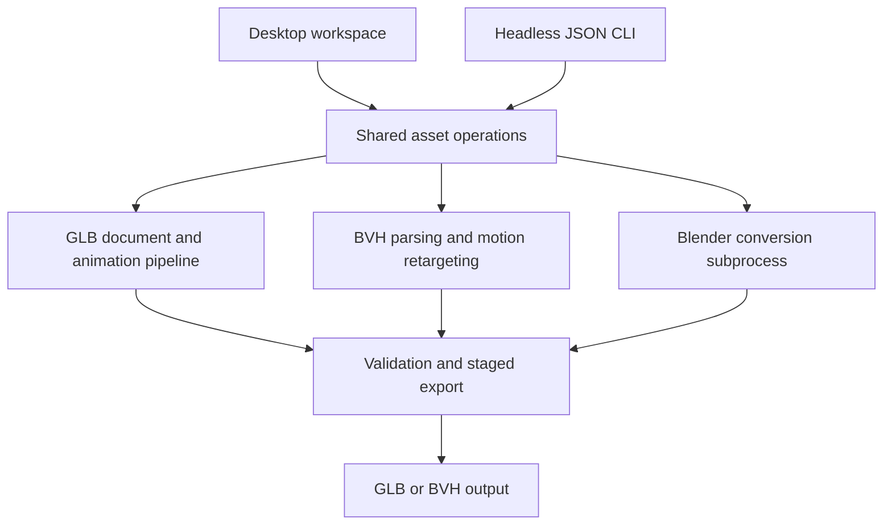

AIO Asset Normalizer is a Rust desktop application and headless CLI for
preparing 3D assets for games. It brings model inspection, GLB editing,
animation cleanup, and motion retargeting into one pipeline, with explicit
export contracts rather than a collection of unrelated conversion scripts.

The core GLB and BVH workflows run in Rust. A separate FBX Converter page uses a
local Blender installation for FBX, OBJ, and Blend inputs; Blender is not
required for the GLB Editor, BVH Studio, or their CLI equivalents.

## From Source Asset to Game Asset

A typical workflow starts with inspecting a character's scene, Skin, materials,
and animation channels. The user can correct its orientation, review playback,
trim a clip, replace textures, and export a normalized GLB. Motion from another
skeleton goes through an explicit mapping and target preview before export.

| Workspace     | Implemented workflow                                                                                                 |
| ------------- | -------------------------------------------------------------------------------------------------------------------- |
| GLB Editor    | Inspect models and skeletons, play animation, edit export settings, replace PBR textures, and retarget GLB animation |
| BVH Studio    | Inspect and trim motion capture, map joints, preview a target Skin, and export retargeted motion                     |
| FBX Converter | Select authoring files and convert them sequentially through a headless Blender process                              |
| Headless CLI  | Inspect, validate, dry-run, and execute asset jobs with structured JSON results                                      |

## GLB Editing and Animation

The editor exposes scenes, nodes, meshes, materials, Skins, and animation clips.
Its viewport supports CPU-skinned playback and skeleton overlays, including
meshless animation GLBs. Playback includes seeking, frame stepping, looping, and
speed controls. Animation sampling supports STEP and LINEAR channels.

Orientation presets handle common up-axis conventions, with Euler input for
precise corrections. Export options control unit scaling, centering, grounding,
and whether corrections are baked into the file or remain preview-only.
Animation trimming also operates on the export copy rather than rewriting the
loaded source.

Smart LOOP closes small capture drift with an adjustable transition. It rejects
significant Root Motion instead of silently turning a moving animation into an
in-place clip. Its current processing contract is LINEAR translation, rotation,
and scale channels on a single Skin.

Material editing covers Base Color, Normal, Metallic-Roughness, Occlusion, and
Emissive textures. Shared-material duplication allows a change to be isolated
rather than unexpectedly affecting every mesh that uses the same material.

## One Mapping Contract for Two Motion Sources

BVH-to-GLB and GLB-to-GLB retargeting share Mapping v2. A mapping identifies the
source and target skeletons, coordinate conventions, units, roots, selected GLB
Skins, and individual bone correspondences. Nodes use names, hierarchy paths,
and indices so duplicate names do not collapse into an ambiguous match.

File and skeleton fingerprints help validate the mapping against its inputs.
Name matching generates suggestions for review; the saved mapping remains the
source of truth. Older Mapping v1 files remain readable for BVH Studio and can
be converted when joint names are unique.

The retargeting pipeline uses authored rest-pose deltas. Source and target
skeleton overlays make the result inspectable before writing a file, while
optional Root Motion, initial-heading normalization, and redundant-key reduction
control how the motion is packaged. Octahedral, Stick, and Lines displays share
stable rest-pose sizing and adaptive camera fitting.

Export can produce a Character Package containing geometry and animation, or an
Animation Clip containing the skeleton and motion. An external-agent prompt
handoff supports mapping work without embedding a coding agent in the
application.

## Shared Desktop and CLI Domain

The document layer retains raw GLB JSON and binary data, changing affected
resources where possible. This preserves unknown extensions and extras without
requiring the editor to reconstruct every part of an asset. Exports are staged
beside the destination, reparsed where applicable, and atomically committed;
source overwrite is not the default.

Expensive work runs on background workers and returns results through message
passing. The CLI reuses those domain operations and emits a versioned JSON
envelope, with diagnostics on stderr and distinct exit codes for usage,
validation, I/O, and external-tool failures. A CLI-only build excludes the
desktop dependency stack.

## Implementation Boundaries

The viewport uses egui through three-d, with gltf for asset loading and
validation, image for texture processing, and Clap for the CLI. The converter
invokes an embedded normalization script in Blender and checks generated GLBs
before reporting success.

CUBICSPLINE sampling, Morph Target playback, GPU skinning, mesh-weight
rebinding, IK/Twist processing, and skeleton replacement are outside the current
feature set. Compressed geometry may be preserved when its skeleton and
animation can be validated, even when it cannot be previewed. Operations that
require unsafe rewriting report the unsupported case.

The engineering focus is a reusable asset-processing core: the desktop provides
visual inspection, while the CLI makes the same contracts available to scripts
and coding agents.
