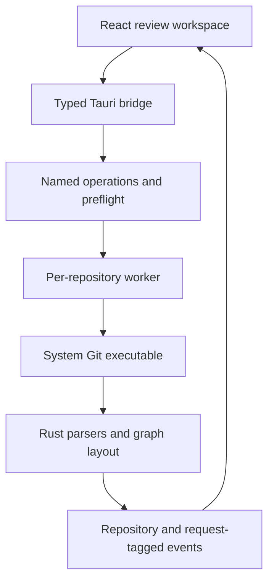

Augur Git is a local desktop Git client built around reviewing changes before
they become project history. It fits beside a terminal, editor, and coding
agent: those tools produce and refine changes, while Augur provides the visual
surface for deciding what to stage, commit, compare, or revisit.

The current application uses Tauri 2, React, TypeScript, and a Rust backend. An
earlier GPUI implementation remains in the repository as a legacy app, with
independent settings and build configuration. The features described here belong
to the active Tauri application.

## Review the Working Tree

The Changes workspace separates staged, unstaged, untracked, and conflicted
files. A developer can move between changed files, inspect inline or
side-by-side diffs, stage or unstage files, and compose a commit against the
staged result. Syntax-aware rendering and character-level highlights help make
small edits visible within larger changes. Image previews provide context for
supported image files alongside text review.

Normal commits and amending the latest commit are explicit operations. Discard,
reset, deletion, and force-push workflows surface their consequences through the
interface rather than hiding them behind an automatic review result.

## Understand History and Compare Revisions

A lane-based commit graph connects hashes, messages, authors, and refs. Search
and per-commit file lists support investigation beyond the current working tree.
Branches, remote-tracking branches, tags, and stashes provide navigation and
explicit repository operations.

The standalone Compare window reads two revisions without checking either out.
It supports file navigation, layout switching, endpoint swapping, diff copying,
and patch export. Patch application leaves changes in the working tree for
review. Merge and rebase preflight checks inspect repository state before an
operation begins, and recovery actions expose the active Git operation.

## Sidecar Beside the Editor

The full desktop layout supports broad repository review. A manually selected
Sidecar mode provides a compact Changes, History, and Branches workspace, with a
contextual full-page Diff view. Its initial width is 420 pixels and its resize
range is 360–520 pixels.

Window bounds are kept separately for the two modes. Commit drafts, searches,
and list positions retain their appropriate repository context, so switching
layout does not require reconstructing the review task. Compare, Settings, and
About remain independent windows.

## Hand Context to an External Agent

The active application generates provider-neutral prompts for commit or amend,
merge, rebase, pull, conflict resolution, and patch assistance. A prompt is
built from a fresh read-only Git snapshot: repository path, branch, HEAD,
upstream, changed files, conflicts, and active operation where relevant.

The user copies the prompt to an external coding agent and returns to Augur to
inspect the resulting changes. This keeps the handoff grounded in repository
state while preserving the existing terminal and agent workflow. The legacy GPUI
application's embedded Agent terminal and Lua extensions are separate features,
not part of this Tauri implementation.

## A Typed Boundary Around Git

The webview requests named operations instead of sending arbitrary shell text.
The Rust backend builds fixed argument vectors and rechecks repository identity,
paths, and operation state. The platform-independent augur-core crate owns Git
parsers, graph layout, diff processing, argument construction, and state probes.

Each repository has a worker that runs Git commands serially, with a separate
event-forwarding thread. Blocking repository work therefore stays off the UI
thread. Events identify their repository and, where needed, their request; the
frontend discards superseded replies so rapidly switching files cannot display
an older diff as the newest result.

Preferences and shortcuts live in settings.json; tabs and pane geometry live in
workspace.json. Both are versioned and validated. Invalid persisted documents
fall back to in-memory defaults with a reported error instead of being silently
overwritten.

## Validation and Distribution

Rust unit tests cover pure domain logic, while pipeline tests drive the real Git
worker against throwaway repositories. Frontend tests cover transformations and
state helpers. Browser tests run the actual components and event reducers with a
stub at the Tauri boundary, allowing races and interaction guards to be checked
without substituting the interface itself.

The application packages for Windows x64, macOS Apple Silicon, and Linux x64.
Nightly update checks read metadata; download and installation remain explicit.
Windows uses the signed Tauri updater, while Homebrew and manual packages have
channel-appropriate upgrade paths.

Augur's engineering emphasis is reliable review: clear diffs, predictable Git
operations, and repository context that stays coherent as the user moves between
files, revisions, and tools.
