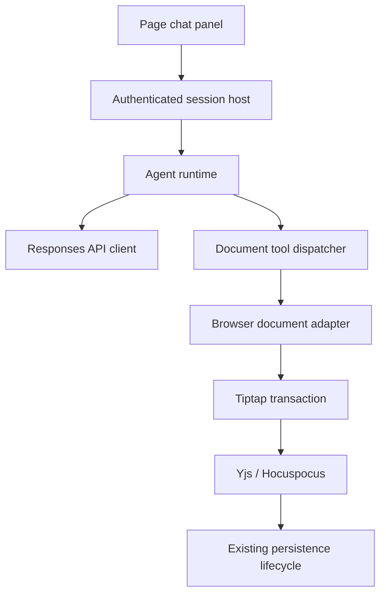

Docmost Personal Fork is a self-hosted knowledge workspace for one person or a
small, trusted group. It began as a fork of Docmost, but the direction is
deliberately local: keep the parts that make a workspace useful and remove the
commercial, cloud-only, and enterprise surfaces that are not needed for a
private deployment.

## Screenshots

> **Screenshot placeholder** — Capture the main workspace with the sidebar,
> spaces, page navigation, and the editor visible here.

> **Screenshot placeholder** — Capture the workspace member settings page and
> the admin-managed account creation flow here.

> **Screenshot placeholder** — Capture the AI page editing panel beside a page,
> including a completed edit and its change summary, here.

## Project Overview

- **Project type**: Self-hosted collaborative knowledge workspace
- **Deployment model**: Docker Compose with PostgreSQL and Redis
- **Audience**: One person or a small group of trusted collaborators
- **Core editor**: Tiptap with Yjs and Hocuspocus real-time collaboration
- **AI integration**: A server-side OpenAI Responses API client with a
  conversational page-editing agent

## Why Build This Fork

Docmost already provides the foundations of a capable knowledge workspace:
pages, spaces, search, comments, history, attachments, embeds, diagrams, and
real-time collaboration. A personal deployment does not need to carry every
workflow designed for a hosted commercial product, though. Billing, trials,
public registration, email delivery, enterprise identity systems, and license
gates all add operational weight without improving the experience of a small
trusted group.

This fork makes that product boundary explicit. It is maintained as an
independent project rather than a compatibility layer for upstream Docmost. The
goal is a focused workspace that is easy to deploy on infrastructure I control,
easy to administer without an SMTP service, and useful for everyday notes,
documentation, and shared reference material.

## Scope Decisions

### A smaller self-hosted surface

The fork removes cloud billing, trials, license pages, public signup, email
invitations, SMTP delivery, and the forgot-password flow. It also removes
enterprise-only surfaces such as SSO, MFA, SCIM, API keys, audit/SIEM tooling,
page verification, templates, personal spaces, bases, PDF export, OAuth apps,
and several licensed import paths.

The result is a clearer operating model: an owner creates accounts directly, the
server shows a one-time password to the administrator, and each member changes
that password after signing in. If a password is lost, an owner or administrator
can reset it and revoke the member's active sessions. An email address remains a
sign-in identifier, but the deployment does not need to send mail.

### Collaboration remains the center

The fork keeps the parts of Docmost that make it valuable as a shared workspace:

- Real-time page editing through Yjs and Hocuspocus
- Pages, spaces, groups, comments, comment resolution, and page history
- Search, attachments, embeds, diagrams, and in-app notifications
- Public share links that can be enabled or disabled per page
- Container-based deployment with PostgreSQL and Redis

The architecture stays close to the existing collaboration and persistence
lifecycle. Changes are applied through the active editor and synchronized to
other sessions instead of writing around the live document in the database.

## Conversational AI Page Editing

The most substantial feature added in this fork is a page-scoped AI editing
agent. The user opens a chat panel beside the current page and asks for a change
in natural language. The agent reads the current page and selection, chooses
from a small set of document tools, observes each result, and continues until
the request is complete or the run stops.

The first release supports:

- Replacing text inside supported blocks
- Inserting and deleting supported blocks, including on an empty page
- Generating and editing fenced code blocks and Mermaid diagrams
- Generating and editing block-level and inline LaTeX formulas
- Multiple focused tool calls within a single request
- Streaming assistant replies rendered as Markdown
- A stop action that reports the actual outcome of the run
- Targeted undo for supported AI changes
- Bounded conversation history for the current page session

An edit is applied to the live document as the agent works. The panel reports a
concise change summary and can navigate to the affected block. This keeps the
interaction closer to a careful coding agent than to a text generator: inspect
the current state, make a bounded change, validate the result, and continue with
fresh context.

The page must remain open and its collaboration connection must stay usable
while a run is active. Navigation, editor destruction, loss of edit access, or
disconnection stops the run; already-applied changes remain visible and are
reported accurately.

## Architecture

The AI feature is split across a server-side runtime and a browser-owned
document adapter. The runtime does not import React, Tiptap, Yjs, NestJS page
services, or database repositories. Instead, the server binds a session to one
user, workspace, page, and editor, then injects authenticated document tools.

The provider credentials stay on the server. The integration is configured with
`AI_API_URL`, `AI_API_KEY`, and `AI_MODEL`, while the browser receives only the
session events and tool results it needs to present the interaction. A small
native HTTP client keeps the Responses API protocol explicit and avoids coupling
document editing semantics to a provider SDK.

The document adapter is responsible for turning the rich editor into a bounded
model-readable buffer, mapping handles and offsets back to document positions,
validating revisions and supported structures, and applying localized Tiptap
transactions. This separation makes the edit behavior testable without a live
model and protects unrelated nodes such as diagrams, tables, and transclusions
from accidental whole-page replacement.

## What I Worked On

This project combines product scoping with full-stack implementation work:

1. Defined a private, non-commercial operating model for the fork.
2. Removed cloud, billing, email, invitation, and enterprise-only surfaces from
   the client and server.
3. Built admin-managed member creation and password reset flows with session
   revocation.
4. Added a provider-neutral agent runtime around the OpenAI Responses protocol.
5. Connected the runtime to the live collaborative editor through validated,
   localized document operations.
6. Added streaming UI, Markdown assistant replies, change summaries, stop
   handling, bounded sessions, and focused tests around the edit buffer.

The project is deliberately opinionated: it favors a small surface that can be
understood and operated by its users over a larger set of hypothetical hosted
product capabilities.

## Outcome

Docmost Personal Fork turns a broad collaborative documentation platform into a
focused private workspace, then extends the editor with an AI agent that can
read and modify the page it is already showing. The result is a practical
deployment for shared notes and documentation, with the infrastructure and
editing boundaries visible enough to trust.
