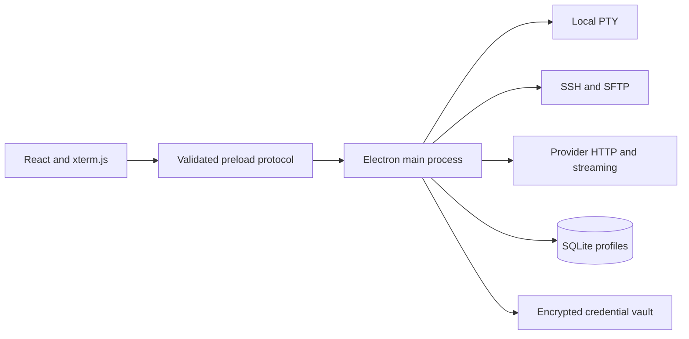

Geared Term is a desktop terminal that combines local shells, remote sessions,
file transfer, and an API-based AI conversation. It is built for the moment when
a developer is reading terminal output, investigating a problem, and deciding
what command to run next.

The assistant can discuss explicitly attached terminal context and present shell
commands as reviewable cards. It does not run an autonomous terminal loop. Copy,
Insert, and Run are separate actions: insertion never submits a command, and
execution requires a deliberate user action.

## A Workspace Around the Session

Each terminal tab has its own session, environment context, and AI conversation.
Saved profiles define an executable, arguments, working directory, or SSH
connection, and are organized into groups. Temporary SSH connections support
one-off work without creating a saved profile.

Local sessions use node-pty; Windows also supports WSL discovery and a bundled
ConPTY runtime. Remote sessions use ordinary SSH with password or private-key
authentication and passphrase support. The remote host needs no Geared Term
service or daemon.

SSH host keys are verified explicitly. Unknown or changed keys block connection
until the trust workflow is resolved. Session lifecycle and transport failures
are surfaced in the interface, with the final terminal output retained after an
unexpected disconnect.

## Files Beside the Terminal

SSH tabs include a dual-pane SFTP browser for local and remote files. Transfers
support recursive operations, byte progress, and cancellation. The remote pane
and shell directory tracking can follow each other's navigation, keeping file
operations close to the command-line task.

Ordinary local shells have a local file browser. Remote text editing is bounded
by file size and checks for save conflicts, so editing a file from the terminal
workspace does not silently overwrite an external change.

## Context-Aware Conversation

The user chooses whether to attach selected terminal text or a viewport snapshot
to a prompt. Attached text is delimited as an untrusted observation, rather than
being treated as assistant instructions. Sharing context is an explicit step in
the conversation.

Provider adapters support OpenAI Responses and compatible Chat Completions
endpoints. Named connections, model discovery, and per-chat model selection
allow the terminal workspace to use different configured providers. Streaming
answers render as Markdown; shell blocks become command cards. Conversation
history is stored as readable Markdown and can be continued later.

This design connects diagnosis and action while keeping the execution decision
visible: inspect the output, ask for an explanation, review the proposed
command, and choose how to use it.

## Process and Credential Boundaries

The Electron main process owns native handles, filesystem access, sockets,
provider requests, SQLite, and decrypted credentials. The renderer receives
serializable state and provider-neutral events through a narrow preload bridge.
Zod schemas validate the shared protocol at runtime.

Terminal traffic uses a dedicated MessagePort after session creation. Sequenced
output, transferable binary chunks, acknowledgments, and bounded outstanding
bytes provide flow control without routing every terminal chunk through a
request-response IPC call. Resource ownership and session transitions make
shutdown and disposal explicit.

Credentials are encrypted with AES-256-GCM using a key derived from the master
password with PBKDF2. Password rotation updates storage transactionally.
Optional password-free unlock uses OS-protected key storage; an unavailable key
service does not trigger a weaker silent fallback.

Structured records live in a migration-aware SQLite database. Small settings,
window state, and known-host documents use versioned JSON with atomic writes and
last-known-good backups.

## Terminal Polish and Delivery

xterm.js provides terminal rendering, with WebGL support, search, Unicode and
CJK handling, configurable font chains, zoom, line height, and ligature
detection. The application includes built-in themes, JSON user themes,
rebindable shortcuts with conflict reporting, and English and Simplified Chinese
interfaces.

Packaging covers Windows x64, macOS Apple Silicon, and Linux x64/ARM64. The
repository contains nightly packaging, Electron end-to-end tests, packaged
startup smoke checks, and Homebrew cask generation. Update behavior depends on
the installation channel, with download or installation initiated by the user.

The project combines terminal transport, desktop security boundaries, and a
conversation interface around one practical principle: suggestions are useful
when the user can inspect both their context and their consequences.
