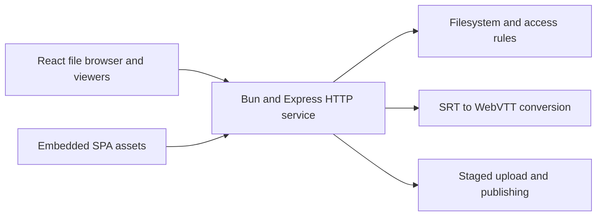

StreamFile Server is a small filesystem-backed publishing service with a React
interface for browsing folders, reading Markdown, uploading files, and playing
media. The backend runs on Bun and uses Express; it requires no database or
account system.

The project keeps files as ordinary files on disk. A server operator can inspect
or move content directly, while the browser adds navigation and viewers around
the same directory tree.

## Browse, Read, and Play

The file browser lists visible folders and files, with recursive,
case-insensitive filename search. Markdown files open in a reading view and
supported media opens in a player. A raw URL serves the underlying bytes, while
a directory index.html can publish a standalone webpage.

Video playback uses Video.js and supports same-directory SRT subtitles. A track
matching the video's basename is selected by default; other tracks can be chosen
or disabled, including in full screen. The backend converts selected tracks to
WebVTT, accepting UTF-8 and GB18030 with strict decoding and an explicit
encoding override.

The conversion path validates timestamps and cue ordering, limits subtitle input
size, and escapes unsupported markup. This makes subtitle handling part of the
server's file contract rather than relying on every browser to understand SRT or
its original encoding.

## Upload Without Overwriting

Uploads first enter an incoming staging directory. An upload with no destination
stays in that inbox and cannot be downloaded through file URLs. A validated
visible destination publishes the file and returns its relative path and URL.

Name collisions generate a numbered filename rather than replacing existing
content. Atomic hard-link creation with an exclusive-copy fallback handles
collisions, including across filesystems. Invalid uploads are removed from
staging, and folder creation uses the same protected-path rules.

## Explicit Access Tiers

| Location             | Browse and search | Direct file access               |
| -------------------- | ----------------- | -------------------------------- |
| Visible files        | Available         | Available                        |
| private-files        | Hidden            | Available when enabled           |
| incoming             | Hidden            | Blocked                          |
| Dot-prefixed entries | Hidden            | Available when targeted directly |

The private-files directory hides content from listings and search; it does not
provide authenticated private sharing. Disabling its feature flag blocks direct
access while retaining the files on disk. Uploads and the home page have
independent flags, enforced by the backend and reflected in browser navigation.

Optional public traffic limits bound request volume and concurrent large
transfers. The application sends rate headers for a configured Nginx proxy to
apply bandwidth limits; the process itself is not a bandwidth shaper. These
limits are opt-in and reset with the server process.

## One Package, Ordinary Files

YAML configuration and data resolve through a consistent home-based layout,
independent of the process working directory. Missing configuration is generated
on first start; an existing invalid file reports an error rather than being
overwritten.

Builds can ship a backend bundle with frontend assets, a Docker image, or a
single executable with the SPA embedded. Standalone targets cover Windows x64,
Linux x64/ARM64, and macOS Apple Silicon. An operator-supplied public directory
with an index.html can override the bundled interface.

The implementation is covered by backend integration tests for access rules,
configuration, subtitles, uploads, and traffic limits, plus frontend unit and
browser tests. Its scope is a lightweight publishing service: filesystem
semantics and deployment remain visible instead of being hidden behind a content
database.
