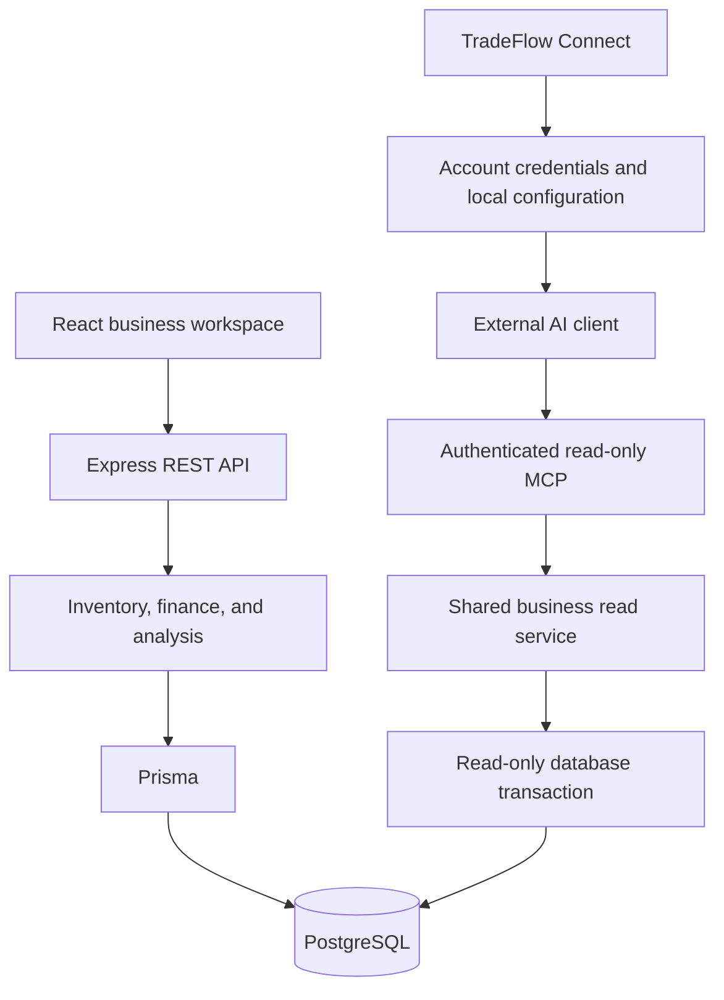

TradeFlow is a trade and inventory workspace for small businesses. Purchases,
sales, products, partners, stock movements, settlements, and financial analysis
share a PostgreSQL data model rather than living in separate spreadsheets.

The current project also exposes business queries through a read-only MCP
service. TradeFlow Connect, a separate Tauri desktop assistant and Rust CLI,
helps users install and verify account-bound connections in external AI tools.

## Connected Business Operations

The browser application organizes everyday work into operations, master data,
finance, and administration. Users record inbound purchases and outbound sales,
maintain product categories and business partners, and review partner-specific
price history. Batch operations support repetitive transaction entry.

Inventory updates follow the transaction paths. A movement ledger records stock
effects, and the inventory service can rebuild totals and ledger entries from
inbound and outbound history. This gives the application a recovery path when
derived inventory needs recalculation.

Receivables and payables connect transaction amounts with recorded payments.
Partner-level summaries lead to detailed account review, while invoice grouping
organizes related transactions. These financial views depend on recorded
business activity rather than a separately maintained balance spreadsheet.

## Analysis With Traceable Cost

Purchase and sales analysis can be filtered by date, partner, and product. Sales
analysis calculates cost of goods sold using FIFO: purchase batches feed a
product-level queue, and sales consume it in historical order. A filtered report
still needs the preceding history to identify the batches consumed by the
selected sales.

The interface combines summary charts with transaction-level detail. Spreadsheet
exports expose operational, settlement, and analytical data for further review.
Decimal.js supports financial calculations, while SheetJS provides export
output. Overview and invoice caches are derived views with their own refresh
paths, not the underlying transaction record.

## Permissions Across Browser and API

JWT authentication and Argon2 password hashing support reader, editor, and
superuser accounts. Browser navigation reflects access, and the API enforces
permissions independently. User administration and audit records provide the
operational controls around business changes.

The browser supports English, Simplified Chinese, and Korean. Its responsive
layout keeps operations and administration available through desktop navigation
or a mobile menu.

## Read-Only Business Tools for Agents

The optional MCP endpoint uses Streamable HTTP and advertises only tools granted
to the credential and permitted for the account's current role.

| Tool              | Business question                                         |
| ----------------- | --------------------------------------------------------- |
| search_partners   | Which customer or supplier matches this name or code?     |
| search_products   | Which product or category matches this query?             |
| get_inventory     | How much stock is on hand?                                |
| list_transactions | Which purchases or sales match these filters?             |
| get_receivables   | What does a customer owe, and what records explain it?    |
| get_payables      | What is owed to a supplier?                               |
| get_analysis      | What are purchasing totals or FIFO sales cost and profit? |

Reader accounts cannot discover or call receivable, payable, or analysis tools.
Authorized queries cover the instance rather than an employee-specific data
partition. Results are paginated, timestamped, and include validated query
parameters; partner contacts, addresses, phone numbers, and free-text remarks
are excluded.

MCP reads use a separate Prisma pool and PostgreSQL read-only transactions.
Queries reuse business calculations without rebuilding inventory or refreshing
other caches. Host/origin checks and bounded request, concurrency, and analysis
budgets surround the endpoint.

Static integration tokens remain supported. Account-bound credentials store only
a SHA-256 digest on the server, expire after 90 days, and are checked against
current account state on every request. Revocation, password changes, account
deletion, or disabling the account prevent subsequent access. Users can inspect
and revoke their own credentials from the browser.

## TradeFlow Connect

The desktop assistant signs in to a TradeFlow server, issues an account-bound
credential, and configures OpenCode V2, WorkBuddy, or both. Its workflow checks
the endpoint, MCP handshake, tool discovery, and a minimal business query before
reporting a verified service connection. Host trust and reload remain user
steps; an endpoint probe alone does not prove the external tool has activated
it.

Configuration edits preserve unrelated servers and JSONC comments. Private
backups, advisory locking, concurrent-change detection, atomic replacement, and
a recovery journal make failed or interrupted setup recoverable. If an external
program changes the file, recovery stops rather than overwriting that work.

The bundled Rust CLI also supports diagnosis, repair, and a stdio bridge. The
bridge forwards tool listing and calls to the server without opening a local
HTTP listener, and can run without the GUI. Switching from direct HTTP to the
bridge is explicit.

Local credential files use restricted filesystem permissions; they are not an
encrypted vault. Passwords are not persisted and login JWTs stay in Rust memory.
Removing a local connection and revoking its remote credential are separate
operations, with redacted cleanup reminders connecting the two.

## Architecture

The frontend uses React, Vite, Ant Design, Recharts, and i18next. The TypeScript
backend uses Express and Prisma with PostgreSQL. TradeFlow Connect has its own
React/Tauri interface and Rust core, so desktop credential setup does not become
a prerequisite for ordinary browser operations.

The server build bundles the browser assets and backend for container delivery;
PostgreSQL remains a separate service. The local deployment companion includes
Docker Compose configuration and PostgreSQL backup tooling. Desktop packaging
ships its CLI as a sidecar, independently of the server container.

## Validation and Current Scope

The repository includes backend tests, an isolated PostgreSQL test-database
workflow, Playwright browser tests, and separate Rust and UI tests for the
desktop assistant. Connection diagnostics check protocol behavior and recovery;
external client activation still depends on its supported version and local
trust settings. TradeFlow Connect is currently documented as a test release.

The project links operational software with bounded AI access: humans continue
to enter and manage business records, while external tools can query the same
inventory and financial calculations through a controlled read-only surface.
